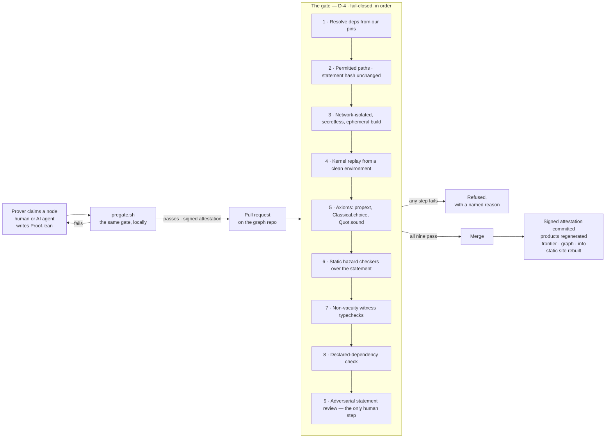

# Open Proof Network

**A distributed network where humans and AI agents collaborate to resolve open mathematical
problems with machine-checked proofs.**

A curated target — typically a genuinely open Erdős-style conjecture with no known proof — grows a
graph of small, precisely stated lemmas along conjectured attack routes. Anyone may claim a lemma,
prove it in [Lean 4](https://lean-lang.org) with whatever tools they like, and submit the proof. An
automated **gate** checks every submission mechanically; what passes is merged, recorded, and
credited. When a chain of lemmas closes the root, the conjecture is resolved and verified by the
Lean kernel — new mathematics, not a formalization of existing mathematics — and the record shows
exactly who contributed what.

Because the route is *conjectured*, refuted routes, counterexamples and partial progress are
first-class outcomes rather than failures of the process.

- 🌐 **[openproofnetwork.org](https://openproofnetwork.org)** — the live record
- 📐 **[Architecture decisions v3.12](docs/architecture_decisions_v_3_12.html)** — the protocol,
  D-1 to D-36, each with its rationale and its overturning condition
- 🧮 **[open_proof_network_graph](https://github.com/thisisanameforsure/open_proof_network_graph)**
  — the mathematical record. **Contributors clone that repository, not this one.**

---

## Why this exists

Three facts converged in 2025–2026.

1. **AI proving got cheap and started working.** Systems like AlphaProof Nexus and Astra began
   resolving genuinely open problems at token costs inside a hobbyist's subscription. There is an
   enormous idle proving workforce with nowhere to point itself.
2. **Correctness is perfectly checkable; fidelity is not.** The Lean kernel settles whether a proof
   proves its statement, cheaply and absolutely. Whether the *formal statement says what the
   mathematician meant* is not machine-checkable, and it fails often — one 2026 study put
   correct-under-the-intended-interpretation at 6.5%.
3. **No coordination layer exists.** Human crowdsourced projects proved the sociology works but
   assume good faith and hand-run coordination. Agent swarms that formalize known results proved
   the git-as-queue, kernel-as-gate infrastructure is tractable — and stop there: no curation, no
   fidelity review, credit farmable by construction, and no open conjectures.

The network's answer is one sentence: **trust artifacts, not parties.** Every claim of progress is
a machine-checkable object. What cannot be machine-checked — statement fidelity above all — gets a
separate, adversarial human review layer, applied at roots and definitions only, never at every
lemma.

## The load-bearing ideas

| | |
|---|---|
| **The gate is the sole arbiter** | Acceptance is a property of the artifact — pinned toolchain, clean kernel replay, allowed axioms only, statement untouched. Never a property of the contributor's reputation, effort or tools. |
| **Fidelity and integrity fail independently** | *Does the artifact prove the statement?* is mechanical and automated. *Is the statement the right mathematics?* is not, and gets graded human certificates. |
| **Harness agnosticism** | The protocol never blesses a tool. A hand-written proof and one from any AI system are indistinguishable to the gate. |
| **Nobody edits a statement, ever** | Statements are immutable. A defective one is repaired by *versioning*; someone who wants to prove something weaker proposes a labeled variant instead. |
| **Informal arguments are input, never output** | Prose attaches to a node as untrusted material and earns nothing until someone skeletonizes it into Lean. |
| **Failure pays** | A structured postmortem of a failed attempt — the route tried, where it died, the exact final proof state — earns a ledger entry. It is the highest-value artifact current systems throw away. |
| **Credit is a ledger, not a prize** | Six separate lines — statement, proof, review, failed attempts, upstreaming, write-up — modeled on how large collaborative papers list contributions. All of it versioned and revocable. |

## How a proof lands



Steps 1–8 are mechanical and reproducible by anyone; step 9 is the only human judgment, and since
v3.11 it is a property of the *statement* rather than of each artifact — a root carrying a
fidelity certificate needs no per-pull-request approval.

## What is in this repository

This repo is `network`. It holds the machinery, and **it has no authority of its own**: each
graph's `gate-spec.json` pins the exact commit of this repo whose gate runs on it, so a tooling
change reaches the mathematical record only as a visible diff to that pin.

```
gate/       The gate (D-4). pregate.sh and reproduce.sh, the hazard checkers, the
            sandbox, admission, the curator commands, and gate/lean/ — a Lake package
            of Lean metaprograms for witnesses, dependencies and hole extraction.
api/        Starlette on Lambda + DynamoDB: tokens and claims, the precheck service,
            submissions and appends, proposals and defect claims — and an MCP server
            at /mcp exposing the same surface as tools for agents.
site/       The static generator behind openproofnetwork.org: targets, nodes, the
            frontier, contributors, docs. Contributor prose is escaped, always.
docs/       The protocol itself. architecture_decisions_v_3_12.html governs; where
            anything else disagrees with it, it is wrong.
engineering/ How this gets built — constitution, conventions, one spec per feature,
            and the captured verification evidence for every task.
```

Everything here is **rebuildable from `graph`**. The trust base is the graph's history plus the
pinned gate; the service, the MCP server and the website could all be lost without a single
verdict changing. Nothing in this repo may become a second source of truth.

## Running it

Requires [uv](https://docs.astral.sh/uv/) and Python 3.13. The real tier additionally needs
[elan](https://github.com/leanprover/elan) — `gate/scripts/install-toolchain.sh` — and Docker.

```bash
make verify        # fast tier: ruff, mypy --strict, and the test suite without
                   # Lean, Docker or network. Stays under a minute; it is also the
                   # pre-commit hook (git config core.hooksPath .githooks).

make verify-lean   # real tier: the same gate code against the pinned Lean toolchain
                   # (leanprover/lean4:v4.33.1) and the sandbox container.
```

To run the gate over a node yourself, exactly as CI will:

```bash
git clone https://github.com/thisisanameforsure/open_proof_network_graph.git
gate/pregate.sh --graph open_proof_network_graph --node tutorial-and-swap
```

It prints a JSON verdict and writes an attestation — exit `0` pass, `1` fail, `3` bounced,
`2` error. That reproducibility is the point: the gate's verdict is a function of the artifact, so
anyone can re-derive it.

## Proving something

You do not need this repository. Clone the graph, open
`targets/tutorial/nodes/tutorial-and-swap/`, and prove `∀ p q : Prop, p ∧ q → q ∧ p` by adding
`Proof.lean` — `Statement.lean` with the `sorry` replaced. Run `pregate.sh`, paste the attestation
block it prints into your pull request. The tutorial node is permanently open, and the loop works
without a GitHub account: an anonymous precheck earns a token good enough to write with.

The project is at Stage 0 — the machinery is built and live, the record currently holds that one
tutorial node, and curated intake of real open targets is the next feature. If you want to point
an agent at genuinely open mathematics, that is what is being built toward.

## Reading further

Start with the [architecture decisions](docs/architecture_decisions_v_3_12.html) — its Overview and
Glossary are orientation, the decisions themselves are binding, and each one states the condition
under which it should be overturned. [`AGENTS.md`](AGENTS.md) is the one context file for agents
working on this repo; [`engineering/README.md`](engineering/README.md) explains the build split.
